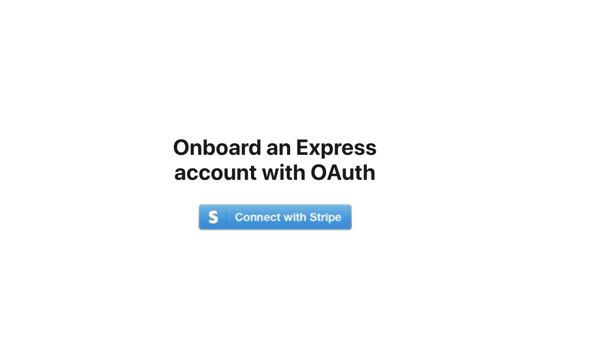

# Connect Express OAuth

This Stripe sample shows you how to create a Connect [Express account](https://stripe.com/docs/connect/express-accounts) using OAuth.
This is the first step if you want to [collect payments then pay out](https://stripe.com/docs/connect/collect-then-transfer-guide) or add funds manually to Stripe and [pay out money](https://stripe.com/docs/connect/add-and-pay-out-guide).



## How to run locally

This sample includes 5 server implementations in Node, Ruby, Python, Java, and PHP.

Follow the steps below to run locally.

**1. Clone and configure the sample**

**Using the Stripe CLI**

If you haven't already installed the CLI, follow the [installation steps](https://github.com/stripe/stripe-cli#installation) in the project README. The CLI is useful for cloning samples and locally testing webhooks and Stripe integrations.

In your terminal shell, run the Stripe CLI command to clone the sample:

```
stripe samples create connect-express-oauth
```

The CLI will walk you through picking your integration type, server and client languages. Make sure to configure your .env file as shown below.

**Installing and cloning manually**

If you do not want to use the Stripe CLI, you can manually clone the sample yourself:

```
git clone https://github.com/stripe-samples/connect-express-oauth
```

Make sure to configure your .env file as shown below.

**Configuring your .env file**

Copy the .env.example file into a file named .env in the folder of the server you want to use. For example:

```
cp .env.example server/node/.env
```

You will need a Stripe account in order to run the demo. Once you set up your account, go to the Stripe [developer dashboard](https://stripe.com/docs/development/quickstart#api-keys) to find your API keys and to your [Connect settings](https://dashboard.stripe.com/settings/applications) to find your client application ID.

```
STRIPE_SECRET_KEY=<replace-with-your-secret-key>
STRIPE_CLIENT_ID=<replace-with-your-client-application-id>
```

`STATIC_DIR` tells the server where to the client files are located and does not need to be modified unless you move the server files.

**2. Follow the server instructions on how to run:**

Pick the server language you want and follow the instructions in the server folder README on how to run.

For example, if you want to run the Node server:

```
cd server/node # there's a README in this folder with instructions
npm install
npm start
```

## FAQ

Q: Why did you pick these frameworks?

A: We chose the most minimal framework to convey the key Stripe calls and concepts you need to understand. These demos are meant as an educational tool that helps you roadmap how to integrate Stripe within your own system independent of the framework.

## Get support
If you found a bug or want to suggest a new [feature/use case/sample], please [file an issue](../../issues).

If you have questions, comments, or need help with code, we're here to help:
- on [IRC via freenode](https://webchat.freenode.net/?channel=#stripe)
- on Twitter at [@StripeDev](https://twitter.com/StripeDev)
- on Stack Overflow at the [stripe-payments](https://stackoverflow.com/tags/stripe-payments/info) tag
- by [email](mailto:support+github@stripe.com)

Sign up to [stay updated with developer news](https://go.stripe.global/dev-digest).

## Author(s)

@emorphis
